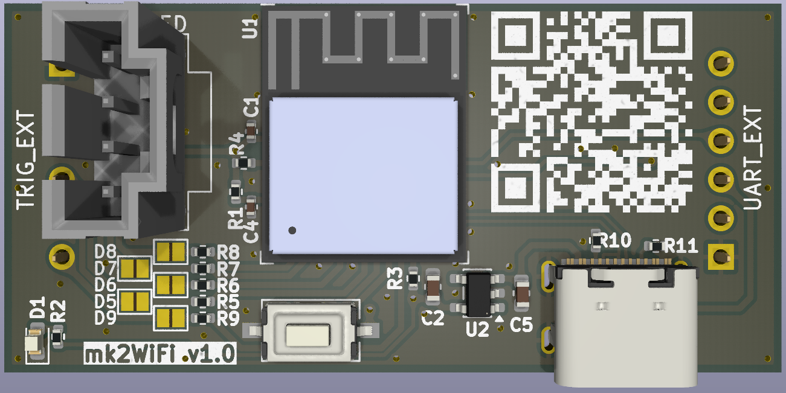
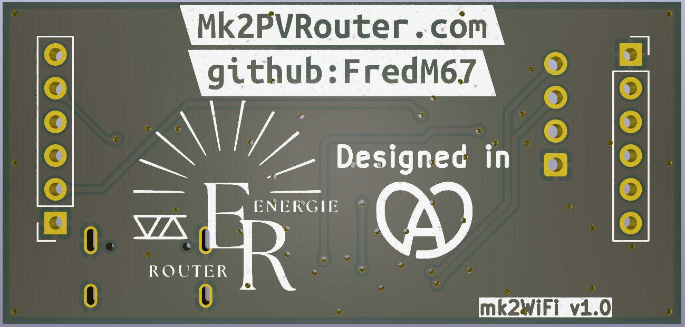
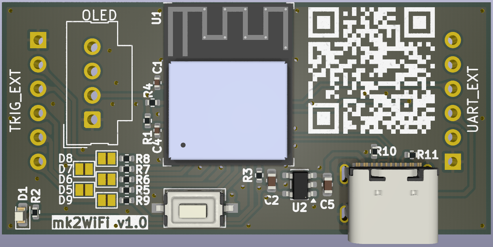
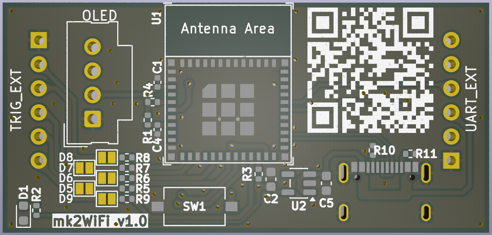
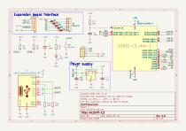

**[Français](Readme.md)** | English

# mk2Wifi

WiFi/BLE expansion module for the Mk2 PV Router mainboard.

## Overview

The mk2Wifi board adds wireless connectivity to the Mk2 PV Router using an **ESP32-C3-MINI-1** module (RISC-V single-core, WiFi 4, Bluetooth LE 5). It plugs directly into the mainboard via the TRIG_EXT and UART_EXT pin headers and is powered by +5V from the mainboard, regulated locally to +3.3V.

Key features:
- WiFi 802.11 b/g/n (2.4 GHz) and Bluetooth LE 5
- USB-C connector for initial firmware upload (subsequent updates via OTA)
- Optional OLED display via I2C (Molex SL connector)
- Five GPIO trigger/control outputs (D5--D9) to the mainboard
- DS18B20 1-Wire temperature sensor passthrough
- UART serial link to the mainboard

## Board images

| Front (fully assembled) | Back |
|:-:|:-:|
|  |  |

| SMD components only | Bare board layout |
|:-:|:-:|
|  |  |

## Schematic

## Design files

| File | Description |
|------|-------------|
| `mk2Wifi.kicad_pro` | KiCad 9 project file |
| `mk2Wifi.kicad_sch` | Schematic |
| `mk2Wifi.kicad_pcb` | PCB layout |
| `mk2Wifi.kicad_dru` | Design rules |
| `mk2Wifi.kicad_sym` | Board-local custom symbol library |
| `sym-lib-table` | Symbol library table |
| `fp-lib-table` | Footprint library table |

## Bill of Materials

| Ref | Value | Package | Description |
|-----|-------|---------|-------------|
| U1 | ESP32-C3-MINI-1 | ESP32-C3-MINI-1 | MCU module with WiFi/BLE |
| U2 | AP2112K-3.3 | SOT-23-5 | 3.3V LDO regulator (600mA) |
| TRIG_EXT | TRIG_EXT | PinSocket 1x06 2.54mm | Trigger/GPIO header |
| USB-C | USB_C_Receptacle | CSP-USC16-TR | USB Type-C receptacle |
| UART_EXT | UART_EXT | PinSocket 1x06 2.54mm | UART + DS18B20 header |
| OLED | OLED | Molex SL 1x04 2.54mm | OLED display connector |
| D1 | LED | 0603 | Power indicator |
| SW1 | SW_Push | CK PTS636S | Boot/reset button |
| R1 | 10K | 0402 | EN pull-up |
| R2 | 1K | 0402 | LED current limiter |
| R3 | 10K | 0402 | GPIO8 pull-up (strapping) |
| R4 | 10K | 0402 | GPIO2 pull-up (strapping) |
| R5 | 1K | 0402 | D9 series protection (GPIO7) |
| R6 | 1K | 0402 | D6 series protection (GPIO10) |
| R7 | 5K1 | 0402 | USB CC1 pull-down |
| R8 | 5K1 | 0402 | USB CC2 pull-down |
| R9 | 1K | 0402 | D7 series protection (GPIO1) |
| R10 | 1K | 0402 | D5 series protection (GPIO4) |
| R11 | 1K | 0402 | D8 series protection (GPIO0) |
| C1 | 100nF | 0402 | +3.3V bypass |
| C2 | 4.7uF | 0603 | Regulator output capacitor |
| C4 | 100nF | 0402 | +3.3V bypass (EN/OLED) |
| C5 | 4.7uF | 0603 | Regulator input capacitor |

## Connector pinouts

### TRIG_EXT (1x6 pin socket)

| Pin | Signal |
|-----|--------|
| 1 | GND |
| 2 | D8 |
| 3 | D7 |
| 4 | D6 |
| 5 | D5 |
| 6 | D9 |

### UART_EXT (1x6 pin socket)

| Pin | Signal |
|-----|--------|
| 1 | GND |
| 2 | DS18B20 |
| 3 | +5V |
| 4 | UART_RX |
| 5 | UART_TX |
| 6 | NC |

Signal names (UART_TX, UART_RX) are from the **mainboard's** perspective: UART_TX carries data transmitted by the mainboard, received by the ESP32-C3 on GPIO20/U0RXD.

### OLED (1x4 Molex SL)

| Pin | Signal |
|-----|--------|
| 1 | GND |
| 2 | VCC (+3.3V) |
| 3 | SCL |
| 4 | SDA |

## ESP32-C3 GPIO mapping

### Connector GPIOs

| GPIO | Pin | Function | Notes |
|------|-----|----------|-------|
| GPIO0 | 12 | D8 (trigger output) | 1K series resistor (R11) to TRIG_EXT pin 2 |
| GPIO1 | 13 | D7 (trigger output) | 1K series resistor (R9) to TRIG_EXT pin 3 |
| GPIO3 | 6 | DS18B20 (1-Wire) | Direct to UART_EXT pin 2 |
| GPIO4 | 18 | D5 (trigger output) | 1K series resistor (R10) to TRIG_EXT pin 5 |
| GPIO5 | 19 | SDA (I2C data) | Direct to OLED pin 4 |
| GPIO6 | 20 | SCL (I2C clock) | Direct to OLED pin 3 |
| GPIO7 | 21 | D9 (trigger output) | 1K series resistor (R5) to TRIG_EXT pin 6 |
| GPIO10 | 16 | D6 (trigger output) | 1K series resistor (R6) to TRIG_EXT pin 4 |
| GPIO18 | 26 | USB D- | To USB-C |
| GPIO19 | 27 | USB D+ | To USB-C |
| GPIO20 | 30 | UART RX (U0RXD) | Receives mainboard TX via UART_EXT pin 5 |
| GPIO21 | 31 | UART TX (U0TXD) | Transmits to mainboard RX via UART_EXT pin 4 |

### Internal GPIOs

| GPIO | Pin | Function | Notes |
|------|-----|----------|-------|
| GPIO2 | 5 | Strapping pin | 10K pull-up (R4); must be high at boot |
| GPIO8 | 22 | Strapping pin | 10K pull-up (R3); must be high for normal boot |
| GPIO9 | 23 | Boot button | SW1 pulls to GND; hold low at power-up for download mode |

## Power supply

In normal operation, **+5V** is supplied from the mainboard through the UART_EXT header (pin 3). The AP2112K-3.3 LDO (U2) regulates this to +3.3V for the ESP32-C3 and OLED display, with a maximum output of 600mA.

Decoupling:
- C5 (4.7uF) on the +5V regulator input
- C2 (4.7uF) on the +3.3V regulator output
- C1, C4 (100nF each) local bypass on +3.3V rails

The USB-C connector can also supply +5V during initial programming when the board is not connected to the mainboard. R7 and R8 (5K1 each) on CC1/CC2 configure the USB-C port as a UFP (sink) to request 5V from the host.

> **WARNING:** Do not connect USB-C while the mk2Wifi board is plugged into the mainboard. The two +5V supplies (USB and mainboard) are not isolated and connecting both simultaneously may damage the board or the USB host.

D1 is a power indicator LED, always on when +3.3V is present (current limited by R2).

## Mainboard integration

The mk2Wifi board plugs into the mainboard's **TRIG_EXT** and **UART_EXT** pin headers:

- mk2Wifi uses **pin sockets** (female); the mainboard uses **pin headers** (male)
- +5V power is supplied from the mainboard through UART_EXT pin 3
- UART (TX/RX) provides serial communication with the mainboard ATmega328P
- DS18B20 signal passes through for 1-Wire temperature sensing
- GPIO signals D5--D9 provide trigger/control outputs
- The I2C bus (SCL/SDA) is **local to the mk2Wifi board only** -- it connects the ESP32-C3 to the OLED display and is not routed to the mainboard

## Programming

1. **Initial firmware upload**: Unplug the board from the mainboard, then connect a USB-C cable. The ESP32-C3 has a built-in USB-serial/JTAG controller -- no external programmer is needed.
2. **Enter download mode**: Hold SW1 (GPIO9 low) during power-up, then release.
3. **Subsequent updates**: Use OTA (Over-The-Air) firmware updates via WiFi. The USB-C connection is only needed for the first flash.
