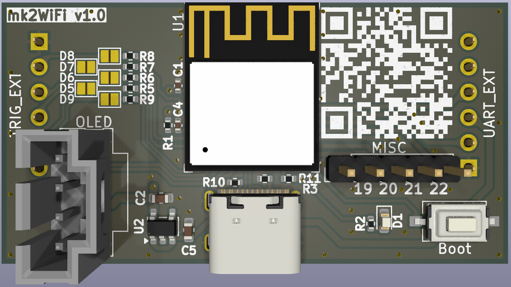
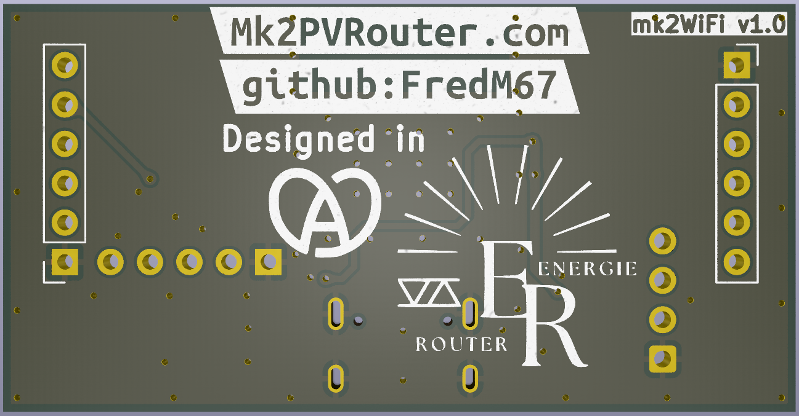
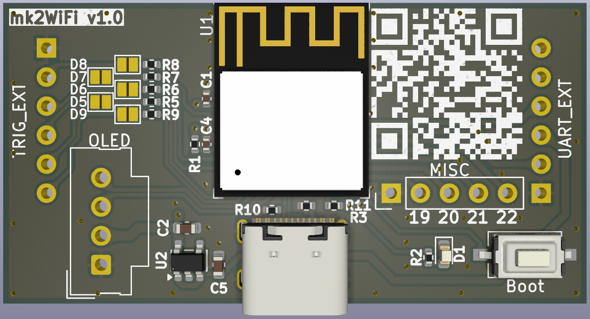
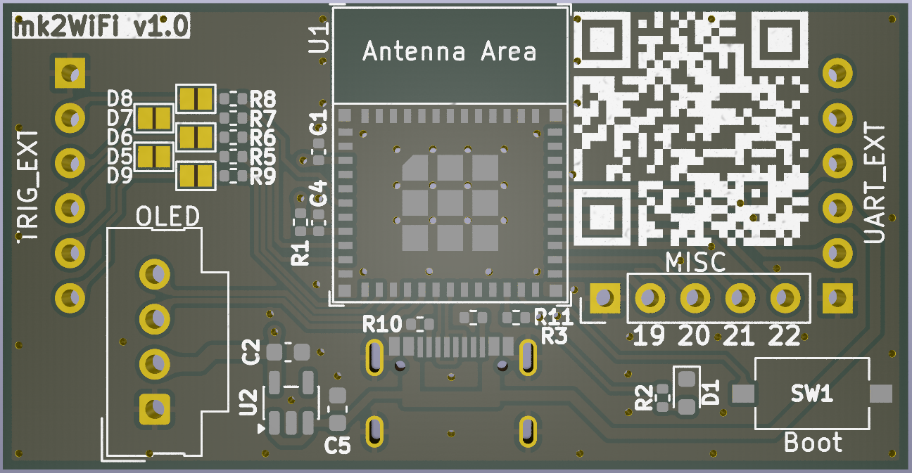
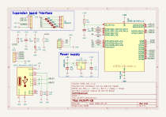

Français | **[English](Readme.en.md)**

# mk2Wifi-C6

Module d'extension WiFi/BLE pour la carte principale Mk2 PV Router.

## Présentation

La carte mk2Wifi-C6 ajoute une connectivité sans fil au Mk2 PV Router grâce à un module **ESP32-C6-MINI-1** (RISC-V simple cœur, WiFi 6, Bluetooth LE 5, Zigbee, Thread). Elle se branche directement sur la carte principale via les connecteurs TRIG_EXT et UART_EXT, et est alimentée en +5 V par la carte principale, régulé localement en +3,3 V.

Caractéristiques principales :
- WiFi 802.11 b/g/n/ax (2,4 GHz) et Bluetooth LE 5
- Zigbee et Thread (802.15.4)
- Connecteur USB-C pour le chargement initial du firmware (mises à jour suivantes via OTA)
- Écran OLED optionnel via I2C (connecteur Molex SL)
- Cinq sorties GPIO de déclenchement/commande (D5–D9) vers la carte principale
- Quatre GPIO supplémentaires (GPIO19–GPIO22) sur un connecteur MISC 5 broches
- Passthrough du capteur de température 1-Wire DS18B20
- Liaison série UART avec la carte principale

## Images de la carte

| Face avant (assemblée) | Face arrière |
|:-:|:-:|
|  |  |

| Composants CMS uniquement | Circuit imprimé nu |
|:-:|:-:|
|  |  |

## Schéma

## Fichiers de conception

| Fichier | Description |
|---------|-------------|
| `mk2Wifi-C6.kicad_pro` | Fichier projet KiCad 9 |
| `mk2Wifi-C6.kicad_sch` | Schéma |
| `mk2Wifi-C6.kicad_pcb` | Circuit imprimé |
| `mk2Wifi-C6.kicad_dru` | Règles de conception |
| `mk2Wifi-C6.kicad_sym` | Bibliothèque de symboles locale |
| `sym-lib-table` | Table des bibliothèques de symboles |
| `fp-lib-table` | Table des bibliothèques d'empreintes |

## Nomenclature (BOM)

| Réf | Valeur | Boîtier | Description |
|-----|--------|---------|-------------|
| U1 | ESP32-C6-MINI-1 | ESP32-C6-MINI-1 | Module MCU avec WiFi 6/BLE/Zigbee/Thread |
| U2 | AP2112K-3.3 | SOT-23-5 | Régulateur LDO 3,3 V (600 mA) |
| UART_EXT | UART_EXT | PinSocket 1x06 2,54 mm | Connecteur UART + DS18B20 |
| TRIG_EXT | TRIG_EXT | PinSocket 1x06 2,54 mm | Connecteur déclenchement/GPIO |
| USB-C | USB_C_Receptacle | CSP-USC16-TR | Embase USB Type-C |
| OLED | OLED | Molex SL 1x04 2,54 mm | Connecteur écran OLED |
| MISC | MISC | PinHeader 1x05 2,54 mm | Connecteur GPIO supplémentaires (GPIO19–22) |
| D1 | LED | 0603 | Témoin d'alimentation |
| SW1 | SW_Push | CK PTS636S | Bouton mode boot (GPIO9) |
| R1 | 10K | 0402 | Pull-up EN |
| R2 | 1K | 0402 | Limitation de courant LED |
| R3 | 10K | 0402 | Pull-up GPIO8 (strapping) |
| R5 | 1K | 0402 | Protection série D5 (GPIO0) |
| R6 | 1K | 0402 | Protection série D6 (GPIO5) |
| R7 | 1K | 0402 | Protection série D7 (GPIO4) |
| R8 | 1K | 0402 | Protection série D8 (GPIO3) |
| R9 | 1K | 0402 | Protection série D9 (GPIO1) |
| R10 | 5K1 | 0402 | Pull-down USB CC1 |
| R11 | 5K1 | 0402 | Pull-down USB CC2 |
| C1 | 100nF | 0402 | Découplage +3,3 V |
| C2 | 4,7uF | 0603 | Condensateur sortie régulateur |
| C4 | 100nF | 0402 | Découplage +3,3 V (EN/OLED) |
| C5 | 4,7uF | 0603 | Condensateur entrée régulateur |

## Brochage des connecteurs

### UART_EXT (barrette 1x6)

| Broche | Signal |
|--------|--------|
| 1 | GND |
| 2 | DS18B20 |
| 3 | +5 V |
| 4 | UART_RX |
| 5 | UART_TX |
| 6 | NC |

Les noms des signaux (UART_TX, UART_RX) sont du point de vue de la **carte principale** : UART_TX transporte les données émises par la carte principale, reçues par l'ESP32-C6 sur U0RXD.

### TRIG_EXT (barrette 1x6)

| Broche | Signal |
|--------|--------|
| 1 | GND |
| 2 | D8 |
| 3 | D7 |
| 4 | D6 |
| 5 | D5 |
| 6 | D9 |

### OLED (Molex SL 1x4)

| Broche | Signal |
|--------|--------|
| 1 | GND |
| 2 | VCC (+3,3 V) |
| 3 | SCL |
| 4 | SDA |

### MISC (barrette 1x5)

| Broche | Signal |
|--------|--------|
| 1 | GND |
| 2 | GPIO19 |
| 3 | GPIO20 |
| 4 | GPIO21 |
| 5 | GPIO22 |

Ces 4 GPIO sont directement connectés à l'ESP32-C6 (broches 25–28) sans résistance série. Ils peuvent être utilisés pour des capteurs, E/S ou interfaces de communication supplémentaires.

## Affectation des GPIO de l'ESP32-C6

### GPIO connecteurs

| GPIO | Broche | Fonction | Notes |
|------|--------|----------|-------|
| GPIO0 | 12 | D5 (sortie déclenchement) | Résistance série 1K (R5) vers TRIG_EXT broche 5 |
| GPIO1 | 13 | D9 (sortie déclenchement) | Résistance série 1K (R9) vers TRIG_EXT broche 6 |
| GPIO3 | 6 | D8 (sortie déclenchement) | Résistance série 1K (R8) vers TRIG_EXT broche 2 |
| GPIO4 | 9 | D7 (sortie déclenchement) | Résistance série 1K (R7) vers TRIG_EXT broche 3 |
| GPIO5 | 10 | D6 (sortie déclenchement) | Résistance série 1K (R6) vers TRIG_EXT broche 4 |
| GPIO6 | 15 | SDA (données I2C) | Direct vers OLED broche 4 |
| GPIO7 | 16 | SCL (horloge I2C) | Direct vers OLED broche 3 |
| GPIO12 | 17 | USB D- | Vers USB-C |
| GPIO13 | 18 | USB D+ | Vers USB-C |
| GPIO16/U0TXD | 31 | Liaison série UART | Net UART_RX — UART_EXT broche 4 (carte principale reçoit de l'ESP) |
| GPIO17/U0RXD | 30 | Liaison série UART | Net UART_TX — UART_EXT broche 5 (carte principale émet vers l'ESP) |
| GPIO19 | 25 | E/S générale | Direct vers MISC broche 2 |
| GPIO20 | 26 | E/S générale | Direct vers MISC broche 3 |
| GPIO21 | 27 | E/S générale | Direct vers MISC broche 4 |
| GPIO22 | 28 | E/S générale | Direct vers MISC broche 5 |
| GPIO23 | 29 | DS18B20 (1-Wire) | Direct vers UART_EXT broche 2 |

### Broches de strapping

L'ESP32-C6 possède 5 broches de strapping échantillonnées au reset pour configurer le démarrage :

| GPIO | Broche | Fonction | Défaut | Traitement sur la carte |
|------|--------|----------|--------|-------------------------|
| GPIO8 | 22 | Mode boot + impression ROM | Flottant | R3 (10K) pull-up vers +3,3 V |
| GPIO9 | 23 | Mode boot | Pull-up faible (1) | SW1 tire vers GND pour le mode téléchargement |
| GPIO15 | 20 | Source JTAG | Flottant | Non connecté (ignoré avec les eFuses par défaut) |
| MTMS/GPIO4 | 9 | Front horloge SDIO | Flottant | R7 (1K) vers D7/TRIG_EXT (SDIO non utilisé) |
| MTDI/GPIO5 | 10 | Front horloge SDIO | Flottant | R6 (1K) vers D6/TRIG_EXT (SDIO non utilisé) |

**Mode boot** (GPIO8/GPIO9) : GPIO9=1 (défaut) sélectionne le démarrage normal depuis la flash SPI. Maintenir SW1 enfoncé pendant le reset pour tirer GPIO9 au niveau bas et entrer en mode téléchargement (USB-Serial-JTAG / UART / SDIO).

**GPIO15** : Contrôle la source du signal JTAG, mais uniquement lorsque `EFUSE_JTAG_SEL_ENABLE`=1. Avec les valeurs d'eFuse par défaut (toutes à 0), GPIO15 est ignoré et le JTAG utilise par défaut le contrôleur USB Serial/JTAG. Aucune résistance de tirage externe n'est nécessaire.

**MTMS/MTDI** : Contrôlent le front d'horloge d'échantillonnage/commande SDIO. Le SDIO n'étant pas utilisé sur cette carte, l'état flottant par défaut à travers les résistances série de 1K n'a aucun effet sur le fonctionnement.

## Alimentation

En fonctionnement normal, le **+5 V** est fourni par la carte principale via le connecteur UART_EXT (broche 3). Le régulateur LDO AP2112K-3.3 (U2) convertit cette tension en +3,3 V pour l'ESP32-C6 et l'écran OLED, avec un courant maximal de 600 mA.

Découplage :
- C5 (4,7 µF) en entrée du régulateur (+5 V)
- C2 (4,7 µF) en sortie du régulateur (+3,3 V)
- C1, C4 (100 nF chacun) découplage local sur les rails +3,3 V

Le connecteur USB-C peut également fournir du +5 V lors de la programmation initiale, lorsque la carte n'est pas connectée à la carte principale. R10 et R11 (5K1 chacune) sur CC1/CC2 configurent le port USB-C en UFP (récepteur) pour demander 5 V à l'hôte.

> **ATTENTION :** Ne pas connecter l'USB-C lorsque la carte mk2Wifi est branchée sur la carte principale. Les deux alimentations +5 V (USB et carte principale) ne sont pas isolées et les connecter simultanément peut endommager la carte ou l'hôte USB.

D1 est une LED témoin d'alimentation, allumée en permanence lorsque le +3,3 V est présent (courant limité par R2).

## Intégration avec la carte principale

La carte mk2Wifi se branche sur les connecteurs **TRIG_EXT** et **UART_EXT** de la carte principale :

- La mk2Wifi utilise des **barrettes femelles** ; la carte principale utilise des **barrettes mâles**
- L'alimentation +5 V est fournie par la carte principale via UART_EXT broche 3
- L'UART (TX/RX) assure la communication série avec l'ATmega328P de la carte principale
- Le signal DS18B20 est acheminé pour la mesure de température 1-Wire
- Les signaux GPIO D5–D9 fournissent les sorties de déclenchement/commande
- Le bus I2C (SCL/SDA) est **local à la carte mk2Wifi uniquement** — il relie l'ESP32-C6 à l'écran OLED et n'est pas routé vers la carte principale

## Programmation

1. **Chargement initial du firmware :** Débrancher la carte de la carte principale, puis connecter un câble USB-C. L'ESP32-C6 dispose d'un contrôleur USB-série/JTAG intégré — aucun programmateur externe n'est nécessaire.
2. **Mode téléchargement :** Maintenir SW1 enfoncé (GPIO9 à l'état bas) pendant la mise sous tension, puis relâcher.
3. **Mises à jour suivantes :** Utiliser les mises à jour OTA (Over-The-Air) via WiFi. La connexion USB-C n'est nécessaire que pour le premier chargement.
