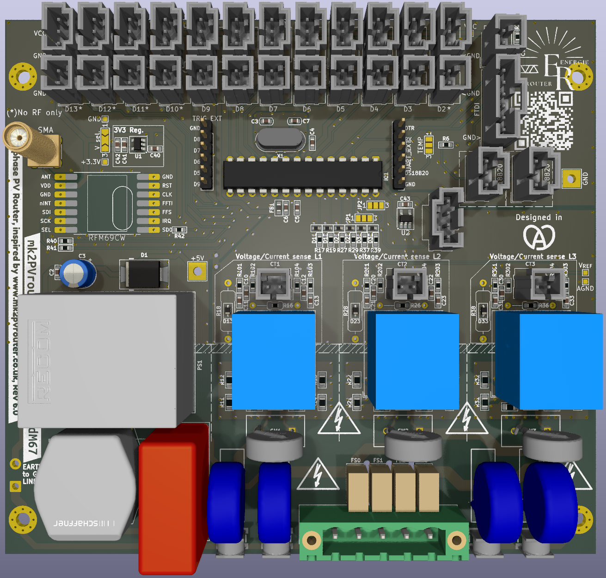
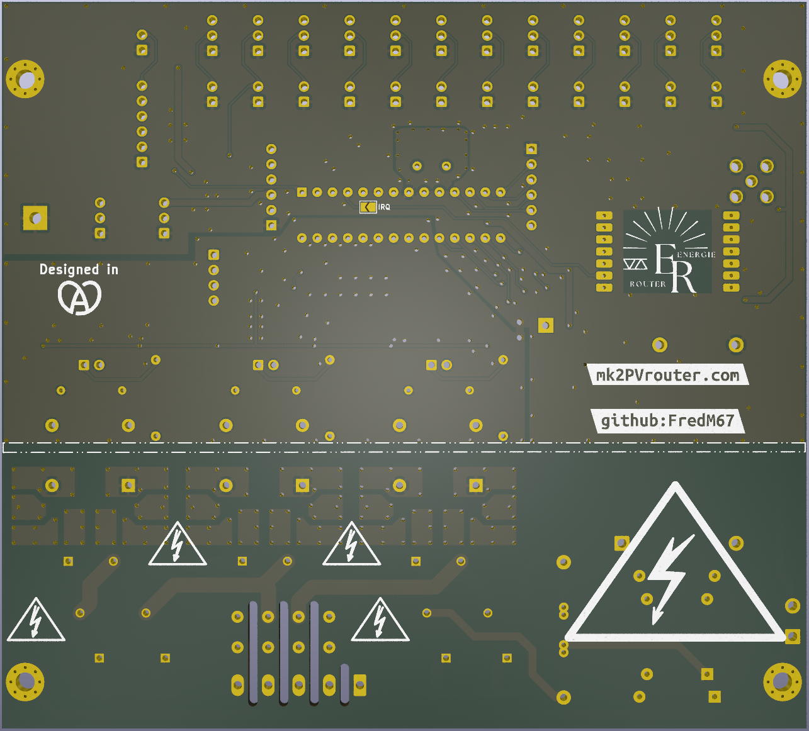
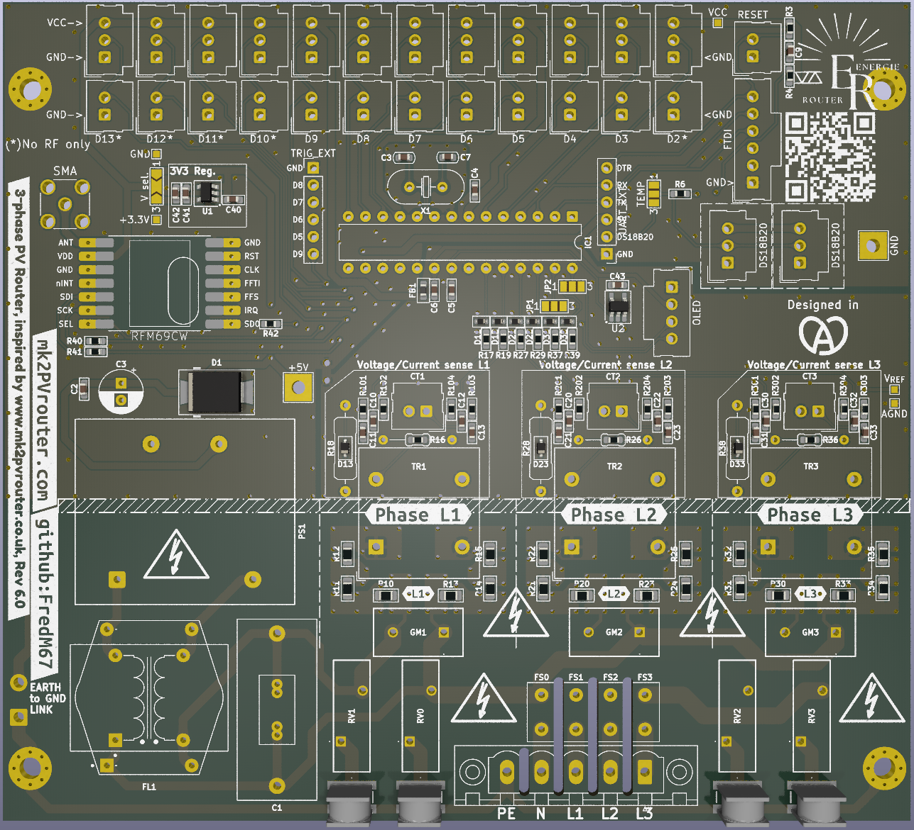
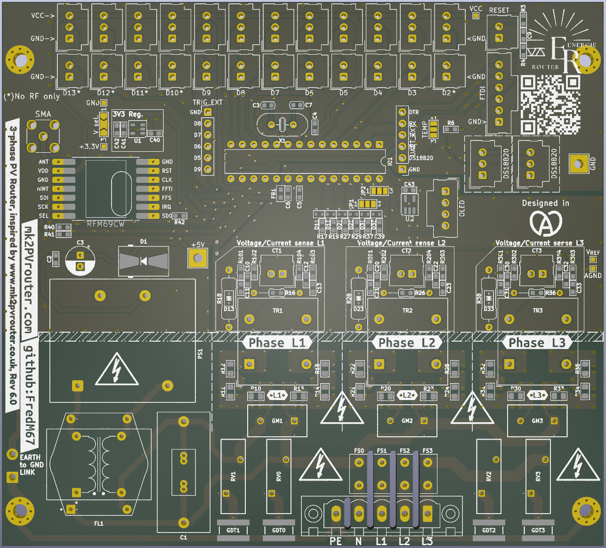

**[Français](Readme.md)** | English

# 3phaseDiverter — Universal mainboard for the Mk2 PV Router

Universal mainboard for the Mk2 PV Router (rev. 6.0). Supports single-phase, 3-phase (with or without neutral), and split-phase configurations.

## Overview

The 3phaseDiverter board is the core of the Mk2 PV Router system -- an open-source solar PV diverter capable of driving up to three loads based on surplus solar production. It is designed to be housed in a Schneider Electric Thalassa enclosure.

Key features:
- **ATmega328P** microcontroller (16 MHz, DIP-28)
- Up to 3 voltage sensors (**ZMPT101K** transformers, 1000:1000 ratio)
- Up to 3 current transformers (**CT1--CT3** connectors)
- **RFM69CW** radio module (433/868 MHz ISM band) with SMA connector
- On-board AC-DC power supply (**Multicomp Pro MPC10-5**, 5V/10W)
- **AP2112K-3.3** LDO regulator (5V to 3.3V, 600mA)
- Multi-layer surge protection (GDT, fuses, MOV, common-mode choke)
- 1.1V internal AREF buffered by **LMV321A** op-amp, per-channel DC bias to VREF/2
- Expansion connectors: **TRIG_EXT**, **UART_EXT**, **FTDI**, **OLED**
- IPC-2221 compliant design for 230V RMS / 325V peak on uncoated FR4

## Board images

| Front (fully assembled) | Back |
|:-:|:-:|
|  |  |

| SMD components only | Bare board layout |
|:-:|:-:|
|  |  |

## Schematic

[](assets/3phaseDiverter-schematic.pdf)

## Design files

| File | Description |
|------|-------------|
| `3phaseDiverter.kicad_pro` | KiCad 9 project file |
| `3phaseDiverter.kicad_sch` | Schematic |
| `3phaseDiverter.kicad_pcb` | PCB layout |
| `3phaseDiverter.kicad_dru` | Design rules |
| `UserDef.kicad_sym` | Board-local custom symbol library |
| `sym-lib-table` | Symbol library table |
| `fp-lib-table` | Footprint library table |

## Bill of Materials

### ICs and modules

| Ref | Value | Package | Description |
|-----|-------|---------|-------------|
| IC1 | ATmega328P | DIP-28 | Microcontroller (16 MHz) |
| U2 | LMV321A | SOT-23-5 | Single op-amp (1.1V AREF buffer) |
| U1 | AP2112K-3.3 | SOT-23-5 | 3.3V LDO regulator (600mA) |
| PS1 | MPC10-5 | Converter_ACDC_MULTICOMP_PRO | AC-DC power supply module (5V, 10W, Multicomp Pro) |
| RF1 | RFM69CW | Custom | ISM band radio module (433/868 MHz) |

### Voltage sensors

| Ref | Value | Package | Description |
|-----|-------|---------|-------------|
| TR1 | ZMPT101K | Custom | L1 voltage transformer (1000:1000) |
| TR2 | ZMPT101K | Custom | L2 voltage transformer (1000:1000) |
| TR3 | ZMPT101K | Custom | L3 voltage transformer (1000:1000) |

### Protection

| Ref | Value | Package | Description |
|-----|-------|---------|-------------|
| GDT0--GDT3 | 2093-300-SM-RPLF | SMD | Gas discharge tubes (4x, one per phase + neutral) |
| GM1--GM3 | GMOV 320V | SMD | Combined GDT+MOV (3x, one per phase) |
| RV0--RV3 | 300V | Radial | Varistors (4x, one per phase + neutral) |
| D1 | SMBJ7.0A | SMB | TVS diode (5V supply protection) |
| D11, D12 | DF2B7AE | SOD-523 | TVS diodes (L1 ADC protection) |
| D21, D22 | DF2B7AE | SOD-523 | TVS diodes (L2 ADC protection) |
| D31, D32 | DF2B7AE | SOD-523 | TVS diodes (L3 ADC protection) |
| D13, D23, D33 | CDSOD323-T03C | SOD-323 | Bidirectional TVS diodes (ADC protection if current-output CT used without burden resistor, one per phase) |
| FS0--FS3 | 1A x 250V | Axial | Fuses (4x, one per phase + neutral) |
| FL1 | RN214-0.3-02-47M | Custom | Common-mode choke (Schaffner) |

### Connectors

| Ref | Value | Package | Description |
|-----|-------|---------|-------------|
| PWR1 | Conn_01x05_PWR | Phoenix Contact MSTBV 2.5 | 3-phase mains input (1x5, 5.08mm pitch) |
| TRIG_EXT | Conn_01x06 | PinHeader 1x06 2.54mm | Trigger/GPIO header |
| UART_EXT | Conn_01x06 | PinHeader 1x06 2.54mm | UART + DS18B20 header |
| FTDI | Conn_01x06 | Molex SL 1x06 2.54mm | Programming/debug connector |
| OLED | Conn_01x04 | Molex SL 1x04 2.54mm | I2C display connector |
| CN1 | BU-SMA-V | SMA vertical | 50 ohm RF antenna connector |
| CT1 | Conn_01x02 | Molex SL 1x02 2.54mm | L1 current transformer input |
| CT2 | Conn_01x02 | Molex SL 1x02 2.54mm | L2 current transformer input |
| CT3 | Conn_01x02 | Molex SL 1x02 2.54mm | L3 current transformer input |

### Passives -- per-phase blocks (x3)

Each phase (L1/L2/L3) has an identical set of components. Numbering follows the pattern 1xx = L1, 2xx = L2, 3xx = L3.

| Ref (L1 / L2 / L3) | Value | Package | Description |
|----------------------|-------|---------|-------------|
| R10--R15 / R20--R25 / R30--R35 | 20K | 0805 | ZMPT101K primary series resistors (6x in series per phase, converts mains voltage to ~2mA) |
| R16 / R26 / R36 | 150R | 0603 | ZMPT101K burden resistor (converts 2mA output to voltage); dual footprint for parallel resistor on 110V supplies |
| R17 / R27 / R37 | 1K | 0603 | Signal conditioning |
| R18 / R28 / R38 | 22R typ. | 0603 | Current CT burden resistor (value depends on CT rating and range) |
| R19 / R29 / R39 | 1K | 0603 | Series protection |
| R101--R104 / R201--R204 / R301--R304 | 10K | 0603 | 50/50 dividers for VREF/2 bias (1 pair per V and I channel) |
| C10 / C20 / C30 | 10uF | 0603 | Inline AC coupling, voltage channel (series between ZMPT101K burden and V bias junction — blocks DC, passes AC signal) |
| C12 / C22 / C32 | 10uF | 0603 | Inline AC coupling, current channel (series between CT and I bias junction — blocks DC, passes AC signal) |
| C11, C13 / C21, C23 / C31, C33 | 100nF | 0603 | Bypass capacitors, bias junction to AGND (C11/C21/C31 voltage, C13/C23/C33 current) |
| D11, D12 / D21, D22 / D31, D32 | DF2B7AE | SOD-523 | TVS diodes (voltage ADC input protection, 2x per phase) |
| D13 / D23 / D33 | CDSOD323-T03C | SOD-323 | Bidirectional TVS diode (ADC protection if current-output CT used without burden R18/R28/R38, 1x per phase) |

### Passives -- common components

| Ref | Value | Package | Description |
|-----|-------|---------|-------------|
| C1 | 1uF 310VAC | Film | Mains filter capacitor (X2 class) |
| C3 | 120uF | Electrolytic | Power supply filtering |
| C2, C40, C41 | 1uF | 0603 | Filtering |
| C4, C5, C6, C9, C42, C43 | 100nF | 0603 | IC bypass |
| C7, C8 | 22pF | 0603 | Crystal load capacitors |
| X1 | 16 MHz | HC-49 | Crystal oscillator |
| R3 | 1M | 0603 | RESET pull-up |
| R4 | 47K | 0603 | Pull-up |
| R6 | 4.7K | 0603 | DS18B20 pull-up |
| R39--R42 | 22R | 0603 | Series termination (SPI) |
| FB1 | Ferrite | 0603 | Ferrite bead (power filtering) |

### Configuration

| Ref | Type | Description |
|-----|------|-------------|
| JP0 | SolderJumper 3-pole | ATmega328P supply: 3.3V (default) or 5V |
| JP1 | SolderJumper 3-pole | A4 selection: L3 voltage sensing or I2C SDA |
| JP2 | SolderJumper 3-pole | A5 selection: L3 current sensing or I2C SCL |
| JP3 | SolderJumper 2-pole | Trigger configuration |
| JP4 | SolderJumper 3-pole | DS18B20 handled by router (D3) or by mk2Wifi module (labelled "TEMP") |
| GND_LINK | SolderJumper 2-pole | GND--AGND bridge (wire jumper) |

### Mounting

| Ref | Description |
|-----|-------------|
| H1--H4 | Mounting holes with pads |

## Connector pinouts

### PWR1 -- Mains input (1x5 Phoenix Contact)

| Pin | Signal |
|-----|--------|
| 1 | Earth |
| 2 | Neutral |
| 3 | L1 |
| 4 | L2 |
| 5 | L3 |

In single-phase mode, a 3-way connector variant is provided (Earth, Neutral, L1).

### TRIG_EXT -- Trigger/GPIO (1x6 pin header)

| Pin | Signal |
|-----|--------|
| 1 | GND |
| 2 | D8 |
| 3 | D7 |
| 4 | D6 |
| 5 | D5 |
| 6 | D9 |

### UART_EXT -- UART + DS18B20 (1x6 pin header)

| Pin | Signal |
|-----|--------|
| 1 | GND |
| 2 | DS18B20 |
| 3 | +5V |
| 4 | RX |
| 5 | TX |
| 6 | DTR |

Signal names (TX, RX) are from the **mainboard's** perspective: TX carries data transmitted by the ATmega328P, RX carries data received.

### FTDI -- Programming/debug (1x6 Molex SL)

| Pin | Signal |
|-----|--------|
| 1 | GND |
| 2 | CTS (NC) |
| 3 | VCC (NC) |
| 4 | TXO |
| 5 | RXI |
| 6 | DTR |

Compatible with standard FTDI adapter pinout. TXO (adapter-to-MCU data) connects to the RX net. RXI (MCU-to-adapter data) connects to the TX net. The DTR signal enables auto-reset for Arduino bootloader uploads.

### OLED -- I2C display (1x4 Molex SL)

| Pin | Signal |
|-----|--------|
| 1 | GND |
| 2 | VCC |
| 3 | SCL |
| 4 | SDA |

The I2C bus is shared on ATmega328P pins A4 (SDA) and A5 (SCL). In 3-phase mode, these pins are assigned to L3 voltage/current sensing -- the OLED display is then unavailable. Selection is made via solder jumpers **JP1** and **JP2**.

### CT1 / CT2 / CT3 -- Current transformers (1x2 Molex SL)

| Pin | Signal |
|-----|--------|
| 1 | CT signal |
| 2 | AGND |

CT1 is used in both single-phase and 3-phase mode. CT2 and CT3 are used in 3-phase mode only.

### CN1 -- RF antenna (SMA)

Vertical SMA female jack (Amphenol 132291-12) for a 50 ohm antenna. Connected to the RFM69CW module via an approximately 8mm trace. The trace is short enough that impedance matching is not critical.

## ATmega328P pin mapping

### Analog inputs

| Arduino Pin | Port | Function | Notes |
|-------------|------|----------|-------|
| A0 | PC0 | L1 voltage sensing | Via resistive divider + ZMPT101K |
| A1 | PC1 | L1 current sensing | Via CT1 |
| A2 | PC2 | L2 voltage sensing | Via resistive divider + ZMPT101K |
| A3 | PC3 | L2 current sensing | Via CT2 |
| A4 | PC4 | L3 voltage sensing / I2C SDA | Selected by JP1 |
| A5 | PC5 | L3 current sensing / I2C SCL | Selected by JP2 |

### Digital outputs and communication

| Arduino Pin | Port | Function | Notes |
|-------------|------|----------|-------|
| D0 | PD0 | UART RX | Serial receive (FTDI, UART_EXT) |
| D1 | PD1 | UART TX | Serial transmit (FTDI, UART_EXT) |
| D2 | PD2 | RFM69CW interrupt | INT0 |
| D3 | PD3 | DS18B20 (1-Wire) | Temperature sensor, when JP4 set to router |
| D4 | PD4 | Digital input | General purpose |
| D5 | PD5 | Trigger output | TRIG_EXT pin 5 |
| D6 | PD6 | Trigger output | TRIG_EXT pin 4 |
| D7 | PD7 | Trigger output | TRIG_EXT pin 3 |
| D8 | PB0 | Trigger output | TRIG_EXT pin 2 |
| D9 | PB1 | Trigger output | TRIG_EXT pin 6 |
| D10 | PB2 | SPI SS | RFM69CW chip select |
| D11 | PB3 | SPI MOSI | Data to RFM69CW |
| D12 | PB4 | SPI MISO | Data from RFM69CW |
| D13 | PB5 | SPI SCK | SPI clock |

## Power supply

### Power chain

Mains power enters through the **PWR1** connector and passes through a protection chain before reaching the power supply module:

```
Mains -> GDT (gas discharge tubes) -> Fuses (FS0-FS3) -> Varistors (RV0-RV3, GM1-GM3)
      -> Common-mode choke (FL1) -> Film capacitor (C1)
      -> PS1 (MPC10-5): 230VAC -> 5VDC, 10W
      -> D1 (SMBJ7.0A): TVS protection on 5V rail
      -> U1 (AP2112K-3.3): 5V -> 3.3V, 600mA
```

### Power rails

| Rail | Voltage | Usage |
|------|---------|-------|
| +5V | 5V | UART_EXT and FTDI connectors |
| +3.3V | 3.3V | ATmega328P, RFM69CW module |
| AVCC | 3.3V (filtered) | ATmega328P analog reference, OLED connector |
| VREF | -- | Analog voltage reference |
| GND | 0V | Digital ground |
| AGND | 0V | Analog ground (linked to GND via GND_LINK) |

### Decoupling

- C1 (1uF 310VAC): mains-side filtering
- C3 (120uF): 5V supply output filtering
- C2, C41 (1uF): secondary filtering
- C4, C5, C6, C9, C42, C43 (100nF): local IC bypass
- C7, C8 (22pF): crystal load capacitors for X1
- FB1 (ferrite): power rail filtering

## Resistor power dissipation

The ADC reference voltage is the ATmega328P internal 1.1V reference, buffered by the LMV321A. The ADC range is therefore 0--1.1V, with a DC bias at the midpoint VREF/2 = 0.55V.

### ZMPT101K primary chain (per phase: 6 x 20K = 120K in series)

| Mains voltage | Current (RMS) | Power per 20K resistor | Total (6 resistors) | 0805 utilisation (125mW rated) |
|---------------|---------------|------------------------|----------------------|-------------------------------|
| 110V | 0.917mA | 16.8mW | 101mW | 13% |
| 230V | 1.917mA | **73.5mW** | 441mW | **59%** |
| 250V | 2.083mA | 86.8mW | 521mW | 69% |

At 230V nominal, the three phases dissipate 3 x 441 = **1.32W** in the divider chains.

### ZMPT101K burden resistor (R16 / R26 / R36 -- 150R)

Secondary current = primary current (1:1 ratio). At 230V: I = 1.917mA.
- P = (1.917mA)^2 x 150 = **0.55mW** -- negligible

### CT burden resistor (R18 / R28 / R38 -- 22R typ.)

Power depends on the CT type and rating.

**Voltage-output CT** (e.g. SCT-013-030, 30A/1V): the burden resistor is built into the CT. R18 is not populated. Dissipation: **negligible**.

**Current-output CT** (e.g. SCT-013-000, 100A/50mA): the secondary current flows through R18. Dissipation depends on the measured primary current:

| Primary current | I secondary (100A/50mA) | P in 22R | 0603 rating (100mW) |
|-----------------|-------------------------|----------|---------------------|
| 20A | 10mA | 2.2mW | 2% |
| 60A | 30mA | 19.8mW | 20% |
| 100A | 50mA | 55mW | 55% |

**Warning:** With a current-output CT, R18 must be sized so the peak voltage does not exceed 0.55V (half the ADC range at VREF = 1.1V). Formula: **R = 0.55V / I_sec_peak**. With 22R, the max peak current is 25mA. The TVS diodes (DF2B7AE) protect the ADC but do not limit current through the burden resistor: if the CT delivers more than expected, the resistor may overheat.

Within the ADC range:
- I_sec_max = 0.55V / 22R = 25mA peak = 17.7mA RMS
- **P = (17.7mA)^2 x 22 = 6.9mW** -- negligible

### VREF/2 bias dividers (R101--R104 / R201--R204 / R301--R304 -- 10K)

Two 10K resistors in series between VREF (1.1V) and GND:
- I = 1.1V / 20K = 55uA
- **P per 10K = 30uW** -- negligible

The 10K value (Thevenin impedance 5K) meets the ATmega328P datasheet recommendation of ≤10K source impedance for the ADC 14pF S/H capacitor. A 100nF bypass capacitor (C11/C13 per phase) from the bias junction to AGND filters high-frequency noise without attenuating the 50Hz signal.

### Other resistors

| Ref | Value | Voltage | Current | Power |
|-----|-------|---------|---------|-------|
| R3 | 1M | 3.3V | 3.3uA | 0.011mW |
| R4 | 47K | 3.3V | 70uA | 0.23mW |
| R6 | 4.7K | 3.3V | 0.70mA | 2.3mW |
| R17 / R27 / R37 | 1K | < 2V | < 2mA | < 4mW |
| R19 / R29 / R39 | 1K | < 1V | < 1mA | < 1mW |
| R40--R42 | 22R | 3.3V | signal | < 5mW |

All resistors outside the ZMPT101K primary chain dissipate less than 5mW. Only **R10--R15 / R20--R25 / R30--R35** have significant dissipation (73.5mW each at 230V, i.e. 59% of the 0805 125mW rating).

## Surge protection

The board implements multi-layer protection compliant with IPC-2221 for operation at 230V RMS on uncoated FR4.

### Protection layers

1. **Gas discharge tubes (GDT0--GDT3)**: first line of defence against transient surges. Part 2093-300-SM-RPLF, 300V spark-over voltage.
2. **Fuses (FS0--FS3)**: 1A x 250V, one per phase and neutral. Limit fault current.
3. **Varistors (RV0--RV3, GM1--GM3)**: clamp residual overvoltages. GM1--GM3 combine a GDT and MOV in a single package.
4. **Common-mode choke (FL1)**: filters common-mode interference on mains lines.
5. **TVS diode (D1, SMBJ7.0A)**: protects the 5V rail at the power supply output.
6. **TVS diodes (D11/D12, D21/D22, D31/D32, DF2B7AE)**: protect the MCU ADC inputs, three per phase (2x DF2B7AE for voltage, 1x CDSOD323-T03C for current if CT used without burden resistor).

### Voltage domains and net classes

The board uses multiple net classes with specific clearance rules:

| Class | Domain | Usage |
|-------|--------|-------|
| Surge | Raw mains + transients | PWR1 pins, GDT pads, fuse pads, Earth |
| HV | Mains (post-protection) | L1/L2/L3_VOLTAGE, NEUTRAL, PS1 AC side |
| HV Divider | Divider midpoints | Nets between HV resistors and sensing resistors |
| Power | 5V/3.3V DC | +5V, +3.3V, GND, VCC |
| Low Power | Analog/signal | VREF, AVCC, op-amp nets |
| CT | Low voltage | Current transformer signals |
| ANT | RF | SMA connector to RFM69 module (~8mm trace) |
| Gnd | Analog ground | AGND |
| Default | Low voltage | General signals |

HV clearance rules are defined in `3phaseDiverter.kicad_dru`. HV-to-LV clearance is 2.5mm; HV-to-HV Divider clearance is 1.0mm.

## Configuration

### Solder jumpers

| Jumper | Poles | Function |
|--------|-------|----------|
| JP0 | 3 | ATmega328P supply: 3.3V (default) or 5V |
| JP1 | 3 | Pin A4: L3 voltage sensing (A4') or I2C SDA |
| JP2 | 3 | Pin A5: L3 current sensing (A5') or I2C SCL |
| JP3 | 2 | Trigger configuration |
| JP4 | 3 | DS18B20 routing (labelled "TEMP") |
| GND_LINK | 2 | GND-to-AGND bridge (0.75mm2 wire jumper) |

### Single-phase vs 3-phase

All SMD components are assembled in production regardless of configuration. Single-phase vs 3-phase selection is done via solder jumpers and connector choice.

In **single-phase** mode, solder jumpers JP1 and JP2 are set to I2C position (SDA/SCL), enabling the OLED display. A 3-way PWR1 connector variant is provided (Earth, Neutral, L1). Only CT1 is connected.

In **3-phase** mode, solder jumpers JP1 and JP2 are set to L3 sensing (A4'/A5' position), which disables the OLED display. The 5-way PWR1 connector is used and all three CTs are connected.

## Expansion module integration

The mainboard is designed to accept the **mk2Wifi** expansion module via the TRIG_EXT and UART_EXT connectors:

- The mainboard uses **pin headers** (male); the mk2Wifi uses **pin sockets** (female)
- +5V power is supplied from the mainboard through UART_EXT pin 3
- UART (TX/RX) provides serial communication with the expansion module
- The DS18B20 signal passes through UART_EXT pin 2 for 1-Wire temperature sensing
- GPIO signals D5--D9 provide trigger/control outputs via TRIG_EXT
- The I2C bus (SCL/SDA) is **local to the mk2Wifi module only** -- it connects the ESP32-C3 to the OLED display and is not routed to the mainboard

## Programming

The **FTDI** connector (Molex SL 1x6) allows firmware upload via a USB-to-serial FTDI or compatible adapter:

1. **Connection**: plug the FTDI adapter into connector J0. The pinout is compatible with standard FTDI cables (GND on pin 1).
2. **Auto-reset**: the DTR signal triggers an automatic ATmega328P reset through a coupling capacitor, allowing upload without manual intervention.
3. **Environment**: Arduino-compatible (ATmega328P with bootloader). Use the "Arduino Uno" board or equivalent in the Arduino IDE.

### DS18B20 temperature sensor

The 1-Wire DS18B20 sensor is always connected on the mainboard. Solder jumper **JP4** selects which device handles the sensor:
- **Router position**: signal is routed to ATmega328P pin D3
- **mk2Wifi position**: signal is routed to the expansion module via UART_EXT pin 2

The required pull-up resistor is built into the board (R6, 4.7K).
