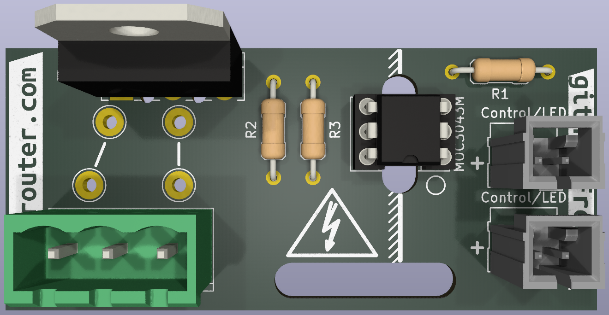
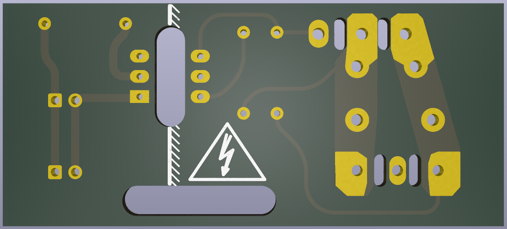
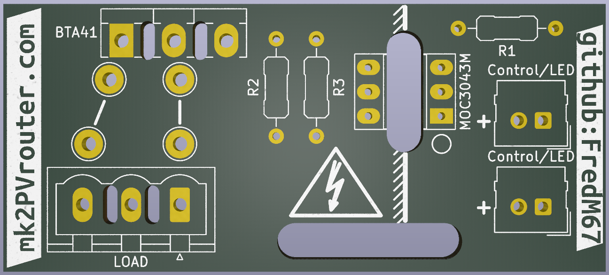

**[Français](Readme.md)** | English

# Output Stage — Power output stage for Mk2 PV Router

Triac power output board for the Mk2 PV Router. Each board drives a mains load (water heater, radiator, etc.) via a power triac controlled by a zero-crossing opto-triac.

## Overview

The output stage provides galvanic isolation between the router's low-voltage logic and the mains load. It uses a **MOC3043M** zero-crossing opto-triac to drive a **BTA41-600B** power triac (41A / 600V).

Key features:
- Zero-crossing switching (reduced EMI)
- Galvanic isolation via opto-triac (MOC3043M, DIP-6)
- 41A / 600V power triac (BTA41-600B, TO-218)
- Control input compatible with 3.3V and 5V (adjust R1)
- Phoenix Contact load connector (5.08mm pitch)

## Board images

| Front (fully assembled) | Back |
|:-:|:-:|
|  |  |

| Bare board layout |
|:-:|
|  |

## Schematic

## Design files

| File | Description |
|------|-------------|
| `Output_stage.kicad_pro` | KiCad project file |
| `Output_stage.kicad_sch` | Schematic |
| `Output_stage.kicad_pcb` | PCB layout |

## Bill of Materials

| Ref | Value | Package | Description |
|-----|-------|---------|-------------|
| U1 | MOC3043M | DIP-6 | Zero-crossing opto-triac (400V) |
| Q1 | BTA41-600B | TO-218 | Power triac (41A, 600V) |
| R1 | 220R | Axial | LED current limiting resistor (3.3V); use 390R for 5V |
| R2 | 330R | Axial | Triac gate resistor |
| R3 | 360R | Axial | Opto-triac output series resistor |
| J1 | Conn_01x03 | Phoenix Contact MSTBVA 2.5 (5.08mm) | Mains load connector |
| J2 | Control/LED | Molex SL 1x02 2.54mm | Control input |
| J3 | Control/LED | Molex SL 1x02 2.54mm | Control input (second channel) |

## Design notes

1. **3.3V supply (default)**: R1 = 220 ohm -> IF ~ 10mA, good margin above Ift = 5mA max.
2. **5V supply**: replace R1 with 390 ohm -> IF ~ 10mA.
3. **MOC3063M (600V)**: if a MOC3063M is used instead of the MOC3043M (VDRM 600V instead of 400V, same Ift = 5mA), replace R2 with 360 ohm.
4. The power terminals on connector J1 are interchangeable (the triac is bidirectional).

## Mainboard integration

Each trigger output (D5--D9) from the mainboard can drive an output stage via the J2/J3 connectors. The control signal is a logic level (3.3V or 5V) that activates the opto-triac's internal LED.
