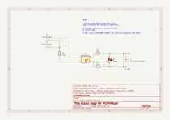

Français | **[English](Readme.en.md)**

# Output Stage — Étage de puissance pour Mk2 PV Router

Carte de sortie à triac pour le Mk2 PV Router. Chaque carte pilote une charge secteur (chauffe-eau, radiateur, etc.) via un triac de puissance commandé par optocoupleur à passage par zéro.

## Présentation

L'étage de sortie assure l'isolation galvanique entre la logique basse tension du routeur et la charge secteur. Il utilise un optocoupleur **MOC3041M** à détection de passage par zéro pour commander un triac de puissance **BTA41-600B** (41 A / 600 V).

Caractéristiques principales :
- Commutation au passage par zéro (réduction des perturbations EMI)
- Isolation galvanique via optocoupleur (MOC3041M, DIP-6)
- Triac de puissance 41 A / 600 V (BTA41-600B, TO-218)
- Entrée de commande compatible 3,3 V et 5 V (ajuster R1)
- Connecteur de charge Phoenix Contact (5,08 mm)

## Schéma

## Fichiers de conception

| Fichier | Description |
|---------|-------------|
| `Output_stage.kicad_pro` | Fichier projet KiCad |
| `Output_stage.kicad_sch` | Schéma |
| `Output_stage.kicad_pcb` | Circuit imprimé |

## Nomenclature (BOM)

| Réf | Valeur | Boîtier | Description |
|-----|--------|---------|-------------|
| U1 | MOC3041M | DIP-6 | Optocoupleur triac à passage par zéro (400 V) |
| Q1 | BTA41-600B | TO-218 | Triac de puissance (41 A, 600 V) |
| R1 | 120R | Axial | Résistance de limitation LED (3,3 V) ; 180R pour 5 V |
| R2 | 330R | Axial | Résistance de gate triac |
| R3 | 360R | Axial | Résistance série sortie optocoupleur |
| J1 | Conn_01x03 | Phoenix Contact MSTBVA 2,5 (5,08 mm) | Connecteur charge secteur |
| J2 | Control/LED | Molex SL 1x02 2,54 mm | Entrée de commande |
| J3 | Control/LED | Molex SL 1x02 2,54 mm | Entrée de commande (second canal) |

## Notes de conception

1. **Alimentation 3,3 V (défaut)** : R1 = 120 Ω. Le courant LED est d'environ 10 mA, suffisant pour déclencher le MOC3041M (Ift = 15 mA max).
2. **Alimentation 5 V** : remplacer R1 par 180 Ω pour limiter le courant LED.
3. **MOC3061M (600 V)** : si un MOC3061M est utilisé à la place du MOC3041M, remplacer R2 par 360 Ω.
4. Les bornes de puissance du connecteur J1 sont interchangeables (le triac est bidirectionnel).

## Intégration avec la carte principale

Chaque sortie de déclenchement (D5–D9) de la carte principale peut piloter un étage de sortie via les connecteurs J2/J3. Le signal de commande est un niveau logique (3,3 V ou 5 V) qui active la LED interne de l'optocoupleur.
